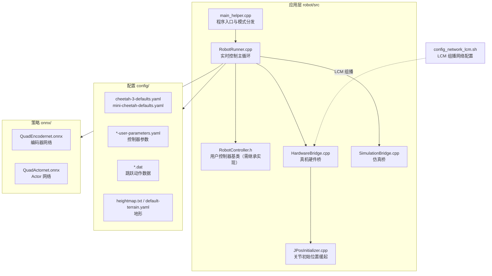

# upboard-robot-software

> **本仓库是四足机器人控制软件的固件备份（firmware dump）**，
> 目标平台为 **UpBoard**（备份经 Jetson Orin NX 中转导出，见仓库首次提交说明）。
>
> ⚠️ **仓库内没有 README，也没有 LICENSE 文件。** 从其文件构成看，
> 本工程**源自 MIT Biomimetics Robotics Lab 的 Cheetah-Software**（详见 [归属与许可证](#归属与许可证)），
> 相关权利归原作者所有，请在使用前自行确认许可状态。

---

## 这是什么

一套**四足（quadruped）机器人的实时控制软件**：包含硬件抽象层、状态估计、腿部控制器、
跳跃动作脚本，以及一个 **ONNX 格式的强化学习策略网络**。

从配置文件名可看出面向的是 Cheetah 系列机型（`cheetah-3-defaults.yaml`、
`mini-cheetah-defaults.yaml`、`mc-mit-ctrl-user-parameters.yaml`）。

---

## 结构总览



---

## 目录结构

```
upboard-robot-software/
├── robot/                         # C++ 控制主体
│   ├── CMakeLists.txt
│   ├── include/
│   │   ├── RobotController.h      # 用户控制器基类（控制代码与硬件代码的接口）
│   │   ├── RobotRunner.h          # 实时运行器
│   │   ├── HardwareBridge.h       # 真机硬件桥
│   │   ├── SimulationBridge.h     # 仿真桥
│   │   ├── JPosInitializer.h      # 关节初始位置缓起
│   │   ├── main_helper.h
│   │   └── rt/                    # 实时相关
│   └── src/                       # 上述头文件对应的实现
├── config/                        # 机型与控制器参数
│   ├── cheetah-3-defaults.yaml
│   ├── mini-cheetah-defaults.yaml
│   ├── c3-jpos-user-parameters.yaml
│   ├── mc-mit-ctrl-user-parameters.yaml
│   ├── initial_jpos_ctrl.yaml
│   ├── simulator-defaults.yaml / default-terrain.yaml
│   ├── heightmap.txt / heightmap_demo.txt
│   └── *.dat                      # 跳跃动作轨迹数据（front_jump_*、mc_flip 等）
├── onnx/
│   ├── QuadEncodernet.onnx        # 编码器网络（约 1.7 MB）
│   └── QuadActornet.onnx          # Actor 网络（约 388 KB）
├── config_network_lcm.sh          # LCM 组播网卡配置脚本
└── build/                         # 构建产物
```

---

## 关键组件

| 组件 | 文件 | 作用 |
|---|---|---|
| 控制器基类 | `robot/include/RobotController.h` | 注释自述：*"Parent class of user robot controllers. This is an interface between the control code and the common hardware code"* —— 控制逻辑与硬件代码之间的接口 |
| 实时运行器 | `robot/include/RobotRunner.h` | 组织控制主循环 |
| 硬件桥 | `robot/include/HardwareBridge.h` | 与真机（UpBoard 侧）通信 |
| 仿真桥 | `robot/include/SimulationBridge.h` | 与仿真器通信 |
| 关节缓起 | `robot/include/JPosInitializer.h` | 上电后平滑过渡到初始关节位置，避免冲击 |
| 依赖模块 | `Controllers/LegController.h`、`Dynamics/FloatingBaseModel.h`、`Controllers/StateEstimatorContainer.h` | 由 `RobotController.h` 直接 include，腿部控制 / 浮动基座动力学 / 状态估计 |

> 注：`RobotController.h` 中 include 的 `Controllers/`、`Dynamics/` 等目录**不在本仓库内**，
> 说明这是一次**不完整的固件导出**，仅包含部分模块。

---

## 通信与网络

`config_network_lcm.sh` 用于配置 **LCM（Lightweight Communications and Marshalling）** 所需的组播网卡：

```bash
sudo ifconfig <iface> multicast
sudo route add -net 224.0.0.0 netmask 240.0.0.0 dev <iface>
```

脚本内置了几台已登记的机器与网卡映射（`thinkpad`、`cynergy`、`xps-wifi`、`mc`、`mc-usb`、`mc-top`），
用法为 `config_network_lcm.sh -I <interface>` 或 `config_network_lcm.sh <computer>`。

> LCM 是 MIT 开发的轻量通信库，其组播机制需要网卡显式开启 multicast 并添加 224.0.0.0/4 路由。

---

## 构建

```bash
cd robot
mkdir -p build && cd build
cmake ..
make -j$(nproc)
```

`robot/CMakeLists.txt` 定义了构建目标。仓库内 `build/` 为已有的构建产物目录。

> 注意：由于缺失被 include 的 `Controllers/`、`Dynamics/` 等模块，**本仓库当前无法独立编译**，
> 需要补齐上游对应源码。

---

## ONNX 策略

`onnx/` 下有两个网络：

| 文件 | 大小 | 推测用途（依据命名） |
|---|---|---|
| `QuadEncodernet.onnx` | ~1.7 MB | 编码器网络（encoder），通常用于把历史观测压缩为隐状态 |
| `QuadActornet.onnx` | ~388 KB | Actor 网络，输出关节动作 |

> 网络结构、输入输出维度与训练来源**未在仓库中提供说明**，此处仅依据文件命名推断，未经核实。

---

## 归属与许可证

### ⚠️ 本仓库缺少 LICENSE 文件

仓库内**不存在 LICENSE 或版权声明文件**，源码头部也没有版权头。因此**无法从仓库自身确认授权状态**。

### 代码来源判断（依据文件构成，非官方声明）

本工程的文件命名与目录组织与 **MIT Biomimetics Robotics Lab** 开源的
**Cheetah-Software**（https://github.com/mit-biomimetics/Cheetah-Software）高度一致，证据包括：

| 证据 | 说明 |
|---|---|
| `robot/include/{RobotController,RobotRunner,HardwareBridge,SimulationBridge,JPosInitializer}.h` | 与 Cheetah-Software 同名同职责 |
| `config/cheetah-3-defaults.yaml`、`mini-cheetah-defaults.yaml` | Cheetah 3 / Mini Cheetah 机型配置 |
| `config/mc-mit-ctrl-user-parameters.yaml` | 文件名含 `mit` |
| `config_network_lcm.sh` 及内置机器名（thinkpad / cynergy / mc…） | Cheetah-Software 自带脚本 |
| 使用 LCM 作为进程间通信 | MIT 的通信库 |

**Cheetah-Software 原始许可证为 BSD-3-Clause**（MIT Biomimetics Robotics Lab）。
若本仓库确为其衍生/备份，**应当保留并补充原始的 BSD-3-Clause 许可证文本与版权声明**。

> 以上为基于文件构成的技术判断，**不是官方归属声明**。建议仓库维护者核实来源后补齐许可证，
> 以免在分发时违反原项目许可条款。

---

## 免责说明

- 本仓库为固件备份，**不保证完整性**（缺失部分依赖模块）与可编译性。
- 四足机器人控制软件涉及**高功率执行器与实时控制**，误用可能导致设备损坏或人身伤害，
  请在安全防护条件下操作。
